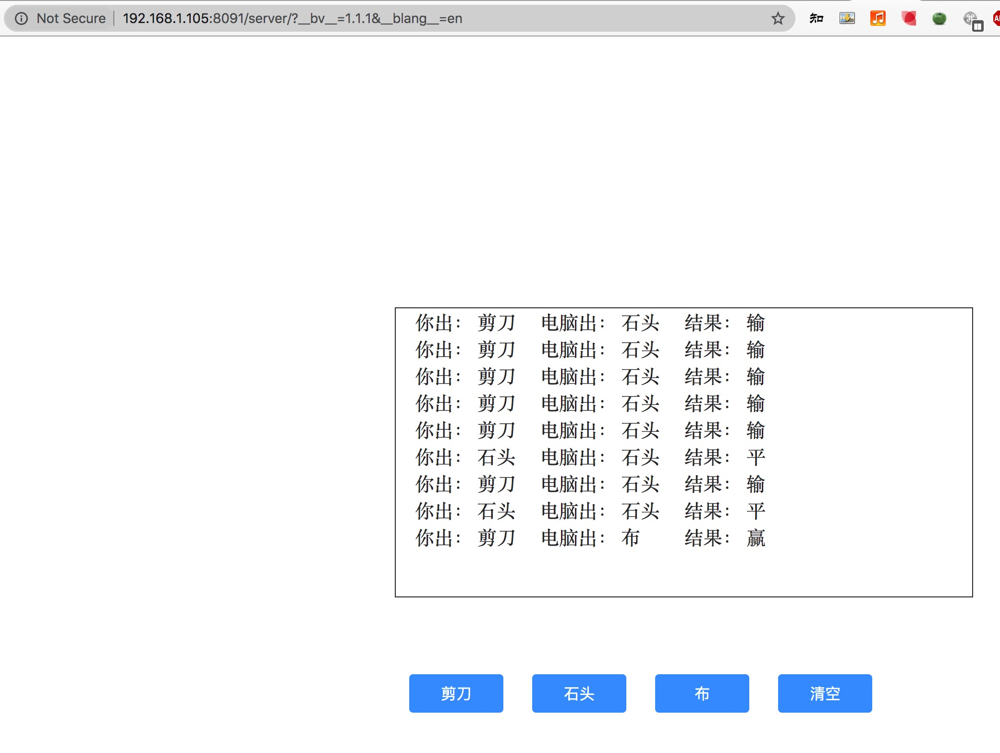

# arcblock-hachaton
将一个简单的石头剪刀布游戏转换成abtnode的blocklet组件。

## requirements
install abtnote 
abtnote start

## step 1 克隆代码到本地

> git clone https://github.com/humyna/arcblock-hachaton

## step 2 进入项目目录
> cd finger-guessing-game-blocklet

## step 3 构建项目
> npm run build

## step 4 打包项目
> abtnode bundle

## step 5 部署
> abtnode deploy .

## step 6 浏览器访问
> http://[your ip]:8089/blocklets

## 游戏截图

## 未来规划 todolist
* 支持用户登录
* 支持用户使用abt换币
* 支持用户授权
* 支持用户下注比输赢

## 参考
* https://www.arcblock.io
* https://github.com/MRLCR/freedom-study-node
  